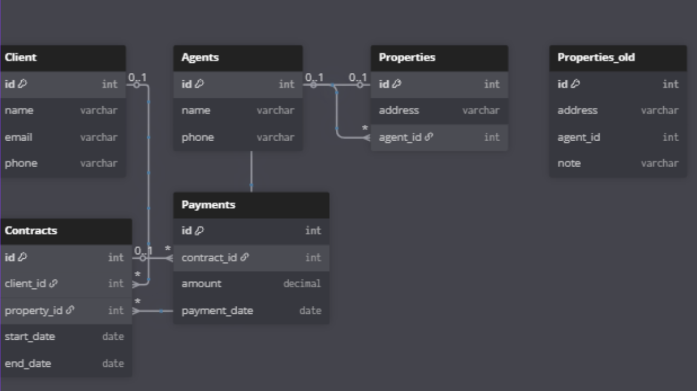

Rental Property Management Database

База даних для автоматизації обліку оренди нерухомості.

Структура проєкту
/schema         — SQL-схеми, ERD  
/sample_data    — тестові дані  
/docs           — документація  
README.md       — основний опис проєкту  

Можливості

✔ облік клієнтів
✔ облік об’єктів нерухомості
✔ створення та супровід договорів
✔ фіксація платежів
✔ архівування історії оренди
✔ логування адміністративних дій
✔ формування звітів

Як запустити

Створити базу:

sqlite3 rental.db < schema/schema.sql

Завантажити дані:

sqlite3 rental.db < sample_data/seed.sql

Документація

Vision → VISION.md

BRD → BRD.md

NFR → NFR.md

Схема БД → schema/erd.asc

Інструкції з розгортання → DEPLOYMENT.md

моя схема з бд 
